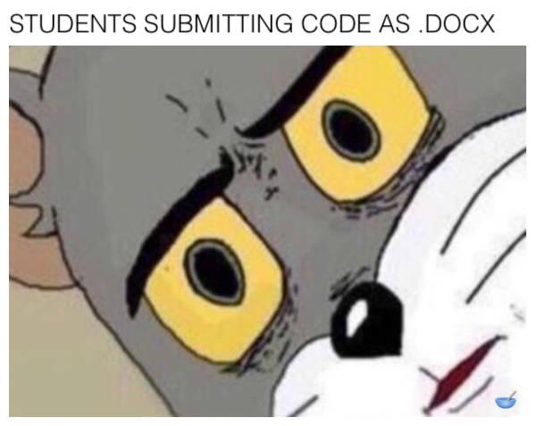

# Hinweise zur Abgabe

Abgabe ist generell in Gruppen von **2-3** Personen möglich. Versucht bitte einigermaßen pünktlich abzugeben.
Programmieraufgaben **müssen per Mail** abgegeben werden (und können auch ausgedruckt abgegeben werden, siehe unten). Dabei ist folgendes zu beachten:
+ Die Dateien müssen als Archivdatei gepackt sein, entweder als `.zip` oder `.tar` (nur bitte kein `.rar` oder `.7z`). Im Dateinamen der Archivdatei kommen die Namen aller aus der Abgabegruppe vor (also bspw. sowas wie `NilsFriess_ErikaMustermann.tar`).
+ Das Dateiformat der einzelnen Dateien ist entweder `.cc` für (Sourcedateien) oder `.hh` (für Headerdateien). Es kann auch vorkommen, dass ihr das Ergebnis eures Programms in einer Textdatei speichern sollt; diese gebt ihr ausgedruckt ab.  
+ Die Dateien sind nach (Teil-)aufgaben zu trennen. Falls eine Teilaufgabe aus mehreren Dateien besteht, dann erstellt am besten für jede Teilaufgabe einen eigenen Ordner.
+ Die Archive enthalten nur den Code, den ihr geschrieben habt (und bspw. nicht die kompilierten Programme) und alle Headerdateien, die zur Übersetzung des Programms notwendig sind.
+ Wäre cool, wenn die Dateien sinnvolle Namen haben, also bspw. `aufgabe1.cc` für die erste Aufgabe, `aufgabe2b.cc` für Aufgabenteil b) der zweiten Aufgabe etc.

Alle anderen Aufgaben werden per Zettelkasten abgegeben. Ihr könnt außerdem gerne Ausdrucke des Programmcodes, den ihr per Mail schickt, abgeben, dann kann ich eure Fehler direkt im Code markieren; falls ihr nur per Mail abgebt, bekommt ihr kein Feedback zu eurem Code.

Hier noch ein Bild von mir, wenn ihr euren Code als Word-Datei abgebt:

# Hinweise zu den hochgeladenen Lösungen

Die Lösungen die ihr in diesem Repository findet sind lediglich Vorschläge. Es handelt sich _nicht_ um Musterlösungen; sie sind oftmals unvollständig und/ oder enthalten Fehler.
